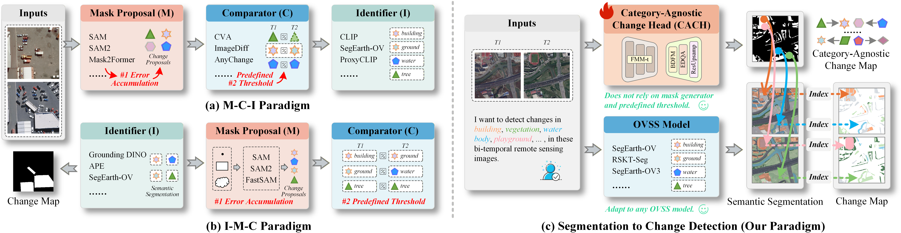
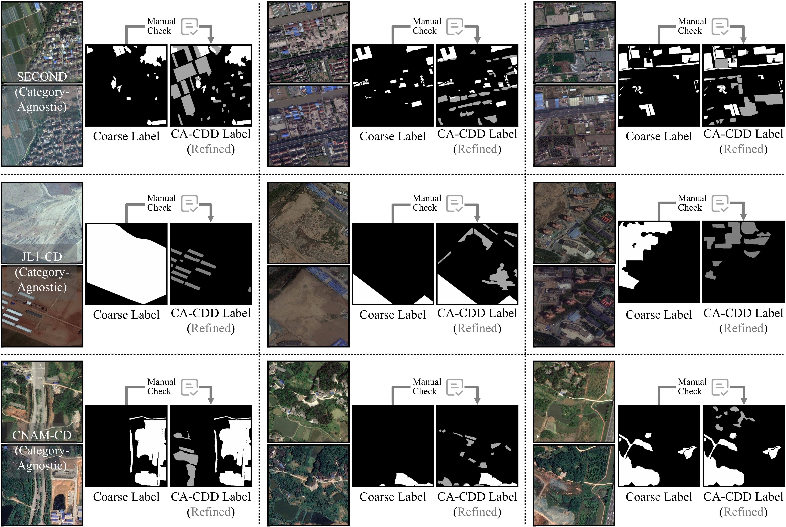

<div align="center">

<h1>Seg2Change: Adapting Open-Vocabulary Semantic Segmentation Model for Remote Sensing Change Detection</h1>

<!-- <h3></h3> -->

<div>
    <strong>Adapting OVSS model for remote sensing OVCD</strong>
</div>

<div>
    <a href='https://github.com/yogurts-sy' target='_blank'>You Su</a><sup></sup>&emsp;
    <a href='' target='_blank'>Yonghong Song</a><sup>✉</sup>&emsp;
    <a href='' target='_blank'>Jingqi Chen</a><sup></sup>&emsp;
    <a href='' target='_blank'>Zehan Wen</a><sup></sup>&emsp;
</div>
<div>
    Xi'an Jiaotong University&emsp;
</div>

<div>
    <h4 align="center">
        • <a href="https://github.com/yogurts-sy/Seg2Change" target='_blank'>[Code]</a> • <a href="https://arxiv.org/abs/2604.11231" target='_blank'>[arXiv]</a> • <a href="https://github.com/yogurts-sy/Seg2Change/blob/main/test_cach_ovcd.py" target='_blank'>[Reproduce]</a> •
    </h4>
</div>

</div>



> Previous paradigms vs. our paradigm. Previous paradigms rely on change proposals and are constrained by the segmentation performance of the proposal generator. Meanwhile, both paradigms (a–b) distinguish changed instances using a predefined threshold, which makes it difficult to accurately delineate change boundaries. In contrast, our paradigm, based on category-agnostic change maps, can effectively leverage more powerful open-vocabulary segmentation models.

## Abstract
> *Change detection is a fundamental task in remote sensing, aiming to quantify the impacts of human activities and ecological dynamics on land-cover changes. Existing change detection methods are limited to predefined classes in training datasets, which constrains their scalability in real-world scenarios. In recent years, numerous advanced open-vocabulary semantic segmentation models have emerged for remote sensing imagery. However, there is still a lack of an effective framework for directly applying these models to open-vocabulary change detection (OVCD), a novel task that integrates vision and language to detect changes across arbitrary categories. To address these challenges, we first construct a category-agnostic change detection dataset, termed CA-CDD. Further, we design a category-agnostic change head to detect the transitions of arbitrary categories and index them to specific classes. Based on them, we propose Seg2Change, an adapter designed to adapt open-vocabulary semantic segmentation models to change detection task. Without bells and whistles, this simple yet effective framework achieves state-of-the-art performance (+9.52 IoU<sup>c</sup> on WHU-CD and +5.50 mIoU<sup>c</sup> on SECOND) under open-vocabulary settings on building, land-cover, and semantic change detection datasets.* 

## A Category-Agnostic Change Detection Dataset (CA-CDD)
> Change detection is a fundamental task in remote sensing that aims to analyze bi-temporal imagery to identify both the locations and types of changes. However, existing datasets are typically constrained to a limited set of predefined change categories. For example, [WHU-CD](http://gpcv.whu.edu.cn/data/building_dataset.html) and [LEVIR-CD](https://justchenhao.github.io/LEVIR/) primarily target building changes, while [DSIFN](https://github.com/GeoZcx/A-deeply-supervised-image-fusion-network-for-change-detection-in-remote-sensing-images/tree/master/dataset) and [CLCD](https://github.com/liumency/CropLand-CD) concentrate on land-cover variations. [SYSU-CD](https://github.com/liumency/SYSU-CD) extends the scope to some extent by including categories such as newly constructed urban structures, vegetation changes, and road expansion. However, it still primarily focuses on urbanization-related changes. Semantic change detection datasets are the closest to category-agnostic ones, yet they differ in several key aspects. Specifically, they usually provide three forms of annotations: semantic segmentation maps at T1 and T2, along with a category-restricted binary change map. These annotations are confined to predefined classes (*e.g.*, [SECOND](https://captain-whu.github.io/SCD/) includes building, tree, water, low vegetation, bareland, playground), and any categories beyond this scope are not labeled (*e.g.*, road or building renovation). Our CA-CDD dataset is constructed using initial bi-temporal images and coarse change maps from the [SECOND](https://captain-whu.github.io/SCD/) training set (2968 pairs), [JL1-CD](https://github.com/circleLZY/MTKD-CD)  training set (1000 pairs), and [CNAM-CD](https://github.com/Silvestezhou/CNAM-CD) training set (1000 pairs). We further refine these coarse annotations through re-labeling to achieve category-agnostic change representations. Importantly, the SECOND test set is exclusively used for evaluation, and no test images from SECOND are included in CA-CDD.



> Visual comparison between CA-CDD category-agnostic change labels and the original coarse labels. We have improved the limited category range of the original labels. At the same time, we have refined the coarse-grained range annotations in the labels to fine-grained annotations. The <b><span style="color:#A5A5A5;">gray</span></b> markings in the figure represent the refinements we made to the original labels.

## Results
**We provide the [training log](https://github.com/yogurts-sy/Seg2Change/tree/main/exp) of each reported value. You can refer to them during reproducing. We also provide the best cach [checkpoints](https://github.com/yogurts-sy/Seg2Change/blob/main/exp/CK/best.pth) of our core experiments.**

### Open-Vocabulary Binary Change Detection (F1<sup>c</sup> / IoU<sup>c</sup>)

| Method            |  Identifier | Comparator | WHU-CD | LEVIR-CD |
| :---------------: | :----------: | :---------: | :-------: | :-------: |
| UCD-SCM      | SAM  | OTSU |   32.13 / 19.14    |  32.36 / 19.30   |
| AnyChange          |    SAM   | Latent Match |  28.13 / 16.37    |   32.68 / 19.53    |
| AnyChange*          | SegEarth-OV3 | Latent Match | 69.25 / 52.96 | <ins>72.27</ins> / <ins>56.58</ins> |
| Inst-CEG            | APE | CEG |  62.54 / 45.49    |  63.29 / 46.30   |
| Inst-CEG*            |  SegEarth-OV3  | CEG |  71.35 / 55.46    |   70.62 / 54.58   |
| DynamicEarth (M-C-I) |  SAM  | Latent Match (DINOv2) |  57.35 / 40.20    |   46.43 / 30.23   |
| DynamicEarth (I-M-C) |  APE  | Latent Match (DINOv2) |   75.85 / 61.09    |   69.70 / 53.50    |
| DynamicEarth* |  SegEarth-OV3  | Latent Match (DINOv2) |  <ins>79.66</ins> / <ins>66.20</ins>    |   71.97 / 56.21    |
| **Seg2Change**   | SegEarth-OV3 | CACH (ours) | **86.18 / 75.72** | **78.72 / 64.91**  |

| Method            |  Identifier | Comparator | DSIFN | CLCD  |
| :---------------: | :----------: | :---------: | :-------: | :-------: |
| UCD-SCM      | SAM  | OTSU  |    40.13 / 25.10  | 23.31 / 13.19 |
| AnyChange          |    SAM   | Latent Match  |    39.19 / 24.37  | 31.96 / 19.02 |
| AnyChange*          | SegEarth-OV3 | Latent Match |  <ins>54.69</ins> / <ins>37.64</ins>    | 27.55 / 15.98 |
| Inst-CEG            |  APE  | CEG |  31.81 / 18.91   |  6.76 / 3.50  |
| Inst-CEG*            |  SegEarth-OV3  | CEG |    47.21 / 30.90   |  10.09 / 5.32 |
| DynamicEarth (M-C-I) |  SAM  | Latent Match (DINOv2) |  54.35 / 37.32 | 23.83 / 13.52 |
| DynamicEarth (I-M-C) |  APE  | Latent Match (DINOv2) | 26.42 / 15.22 | 14.97 / 8.09 |
| DynamicEarth* |  SegEarth-OV3  | Latent Match (DINOv2) | 39.30 / 24.45 | <ins>38.16</ins> / <ins>23.58</ins> |
| **Seg2Change**   | SegEarth-OV3 | CACH (ours) | **58.56 / 41.40**  | **47.89 / 31.48**  |

### Open-Vocabulary Semantic Change Detection (mF1<sup>c</sup> / mIoU<sup>c</sup>)

| Method            |  GPU Memory (GB) | Inference Time (ms) | SC-SCD | SECOND |
| :---------------: | :----------: | :---------: | :-------: | :-------: |
| UCD-SCM      |  9.46 (100%)  |  3225 (100%) |    12.06 / 6.51    |  14.63 / 8.40 |
| AnyChange          |     <ins>6.59</ins> (69%)   |  3988 (124%) |  16.51 / 9.32    | 19.54 / 11.84 |
| AnyChange*          |    10.15 (107%)   |  <ins>2683</ins> (83%) | 16.64 / 9.48 | 21.30 / 13.81 |
| Inst-CEG            |  14.95 (158%)  | 5672 (176%) | 6.90 / 3.68 | 17.82 / 10.46 |
| Inst-CEG*            |  7.08 (75%)  | 2928 (91%) | 23.57 / 14.35 | 29.35 / 18.40 |
| DynamicEarth (M-C-I) |  7.33 (77%)  | 5035 (156%) | <ins>29.11</ins> / <ins>17.97</ins> | <ins>37.51</ins> / <ins>23.58</ins>  |
| DynamicEarth (I-M-C) |   15.33 (162%)  |  6784 (210%) | 9.19 / 5.16 | 22.17 / 13.72 |
| DynamicEarth* |  11.19 (118%)  | 2892 (89%) | 19.87 / 11.47 | 25.43 / 15.24 |
| **Seg2Change**   | **6.08** (64%) | **1521** (47%) | **35.68 / 23.22** | **42.89 / 29.08**  |

## Datasets
We include the following dataset configurations in this repo: 
1) `Building Change Detection`: [WHU-CD](http://gpcv.whu.edu.cn/data/building_dataset.html), [LEVIR-CD](https://justchenhao.github.io/LEVIR/)
2) `Land-Cover Change Detection`: [DSIFN](https://github.com/GeoZcx/A-deeply-supervised-image-fusion-network-for-change-detection-in-remote-sensing-images/tree/master/dataset), [CLCD](https://github.com/liumency/CropLand-CD)
3) `Semantic Change Detection`: [SC-SCD](https://zenodo.org/records/17218853), [SECOND](https://captain-whu.github.io/SCD/)

Please crop the images to a resolution of 512×512 for dataset preparation and organize them into `~/A`, `~/B`, `~/label`. We also provide processed evaluation datasets, as well as our Category-Agnostic Change Detection Dataset (<b>CA-CDD</b>), in [OVCD_Benchmark.zip](https://pan.baidu.com/s/1E9rYpQDidek_qhx3yD1WGA?pwd=5egw).

## Dependencies and Installation

Please follow the version information provided in `requirements.txt`. The installation procedure for the key dependencies is as follows:
```bash
# 1. Python version and Conda environment setup
conda create -n seg2change python=3.9.25

# 2. torch, torchvision, torchaudio, xformers
pip install torch==2.4.1 torchvision==0.19.1 torchaudio==2.4.1 xformers==0.0.28.post1 --index-url https://download.pytorch.org/whl/cu121

# 3. mmcv
pip install -U openmim
mim install mmcv==2.2.0

# 4. Comment out the mmcv version constraint in mmseg:
# (in /root/miniconda3/envs/seg2change/lib/python3.9/site-packages/mmseg/init.py, lines 61–63)

# assert (mmcv_min_version <= mmcv_version < mmcv_max_version), \\
#     f'MMCV=={mmcv.__version__} is used but incompatible. ' \\
#     f'Please install mmcv>=2.0.0rc4.'

# 5. other dependencies
pip install -r requirements.txt
```

## Download Checkpoints
Please download the pretrained weights for SAM3 and DINOv2 and place them in the corresponding directories.
1. Download checkpoints from [HF](https://huggingface.co/facebook/sam3) or [ModelScope](https://modelscope.cn/models/facebook/sam3) and put it into `./weights/sam3`.
2. Download checkpoints from [DINOv2-Small](https://dl.fbaipublicfiles.com/dinov2/dinov2_vits14/dinov2_vits14_pretrain.pth) | [DINOv2-Base](https://dl.fbaipublicfiles.com/dinov2/dinov2_vitb14/dinov2_vitb14_pretrain.pth) and put it into `./weights/dinov2`.
3. Download checkpoints from [best.pth](https://github.com/yogurts-sy/Seg2Change/blob/main/exp/CK/best.pth) and put it into `./weights/cach`.
 
## Model Evaluation

```python
# 1. Download the Processed_Dataset.zip (dataset_root_path)
# 2. Download pretrained weights sam3 and dinov2-base and install dependencies
# 3. Modify `checkpoint_path`, `save_path`, and `dataset_root_path` in the parser of test_cach_ovcd.py.
python test_cach_ovcd.py --test_dataset WHU-CD # e.g., WHU-CD
```

## Model Training
```python
# 1. Download the Processed_Dataset.zip (dataset_root_path, our CA-CDD in it)
# 2. Download pretrained weights sam3 and dinov2-base and install dependencies
# 3. Modify 'feat_path', `checkpoint_path`, `save_path`, and `dataset_root_path` in the parser of train_cach_dino.py.
python train_cach_dino.py
```


## Citation
```
@misc{su2026seg2change,
      title={Seg2Change: Adapting Open-Vocabulary Semantic Segmentation Model for Remote Sensing Change Detection}, 
      author={You Su and Yonghong Song and Jingqi Chen and Zehan Wen},
      year={2026},
      eprint={2604.11231},
      archivePrefix={arXiv},
      primaryClass={cs.CV},
      url={https://arxiv.org/abs/2604.11231}, 
}
```

## Acknowledgement
This implementation is based on [SegEarth-OV3](https://github.com/earth-insights/SegEarth-OV-3), [DynamicEarth](https://github.com/likyoo/DynamicEarth/tree/main), and [UCD-SCM](https://github.com/StephenApX/UCD-SCM). Thanks for their awesome work.

